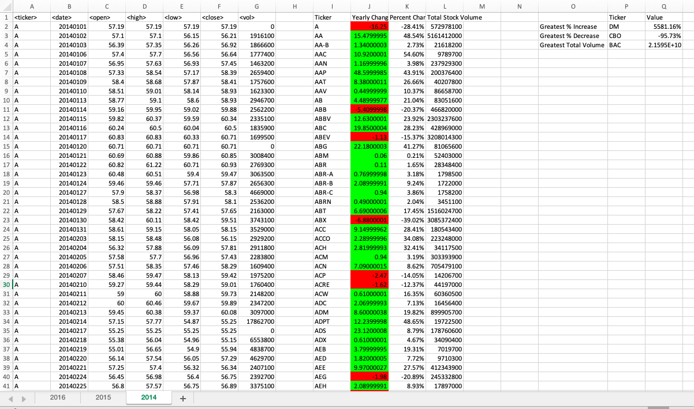
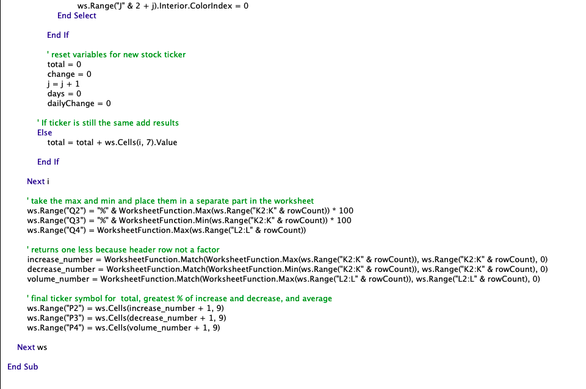

# The VBA of Wall Street - Stock Market Analysis

### Background

In this project, I used VBA scripting to analyze real stock market data in 2014, 2015, 2016, with more than 700,000 stocks data in each worksheet, and did the following.

* Created a script that looped through the stock data for each run on every worksheet, (i.e., every year, just by running it once) and return the following:
   
    * Total volume each stock had over that year. 
    ( I displayed the ticker symbol to coincide with the total stock volume.)

    * Yearly change from opening price at the beginning of a given year to the closing price at the end of that year.

    * The percent change from opening price at the beginning of a given year to the closing price at the end of that year.

    * The total stock volume of the stock.
    ( I have conditional formatting that will highlight positive change in green and negative change in red.)

    * The stock with the "Greatest % increase", "Greatest % Decrease" and "Greatest total volume".

### Result

### VBA scripts

